[](https://classroom.github.com/a/uyodabcP)

## Лабораторная работа: Реализация MapReduce для анализа данных о продажах с ипользованием YT!!!

# Цель работы

Ознакомиться с концепцией распределенных вычислений на примере модели MapReduce. Научиться разрабатывать многопоточную систему для обработки больших данных и применять её для анализа данных о продажах.

# Описание задачи

У вас в репозитории есть несколько CSV-файлов, представляющих данные о продажах, например:

    transaction_id,product_id,category,price,quantity
    1,101,electronics,300.00,2
    2,102,books,15.00,5
    3,101,electronics,300.00,1
    4,103,toys,25.00,4
    5,102,books,15.00,3

Необходимо:

  * Вычислить общую выручку для каждой категории товаров.
  * Подсчитать общее количество проданных товаров по категориям.
  * Отсортировать категории по общей выручке в порядке убывания.

Пример вывода:

    Category      Revenue    Quantity
    electronics   900.00     3
    books         120.00     8
    toys          100.00     4

# Требования

Основная часть:

  * Используем ytsaurus
  * Написать реализацию MapReduce для обработки CSV-файлов.
  * Реализовать многопоточность в каждой фазе:
      * Map — обработка строк из файлов.
      * Shuffle/Sort — группировка данных по категориям.
      * Reduce — вычисление итоговых значений для каждой категории.
  * Сохранить результат в файл.
  * Обеспечить потокобезопасность при работе с общими данными.
  * Реализовать поддержку одновременной обработки большого количества файлов.

Дополнительные задачи (по желанию):

* Добавить возможность выбора метрики анализа (например, подсчёт средней цены товара в категории).

# Результаты

Результатом работы является сам код, файл с результатами и экспериментальные данные по быстродействию работы написанного кода при изменении числа worker-ов / частей, на которые разбивается файл

# Ход работы

## Характеристики хоста

32 GB RAM, 8 cores.

## Запуск YTенка

По туториалу на https://ytsaurus.tech/docs/ru/overview/try-yt.

```bash
mkdir ~/yt-local && cd ~/yt-local
curl -s https://raw.githubusercontent.com/ytsaurus/ytsaurus/main/yt/docker/local/run_local_cluster.sh > run_local_cluster.sh
chmod +x run_local_cluster.sh

./run_local_cluster.sh
```

Далее идем на `127.0.0.1:8001`, если правильно пробросили все порты, и наблюдаем прекрасный YT Web UI.

## Импорт данных

По туториалу на https://ytsaurus.tech/docs/ru/overview/try-yt#create-table.

Устанавливаем YT CLI.

```bash
pip3 install --user ytsaurus-client --break-system-packages
```

Устанавливаем адрес YT Proxy.

```bash
export YT_PROXY=localhost:8000
```

Создаем директории.

```bash
yt create map_node //home/lab3
yt create map_node //home/lab3/init
```

Загружаем csv-файлы через Web UI. В итоге получаем следующую картину.

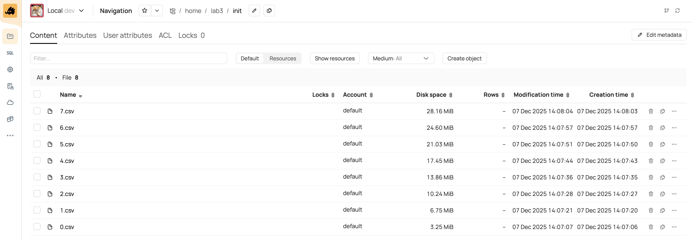

## Подготовка данных

Разраб распарсим csv в список структур при помощи YQL на примере `0.csv`.

```yql
USE locasaurus;

PRAGMA File("0.csv", "yt://locasaurus/home/lab3/init/0.csv");

$read_tx_csv = ($path) -> {
    $lines = ParseFile("String", $path);

    $lines = ListFilter($lines, ($line) -> {
        RETURN NOT String::StartsWith($line, "transaction_id");
    });

    $lines = ListMap($lines, ($line) -> {
        $columns = String::SplitToList($line, ",");
        $columns = Ensure($columns, ListLength($columns) == 5);

        RETURN <|
            transaction_id: Unwrap(CAST($columns[0] AS Uint64)),
            product_id:     Unwrap(CAST($columns[1] AS Uint64)),
            category:       Unwrap(CAST($columns[2] AS String)),
            price:          Unwrap(CAST($columns[3] AS Double)),
            quantity:       Unwrap(CAST($columns[4] AS Uint64)),
        |>;
    });

    RETURN $lines;
};

SELECT
    *
FROM
    AS_TABLE($read_tx_csv("0.csv"))
LIMIT 8;
```

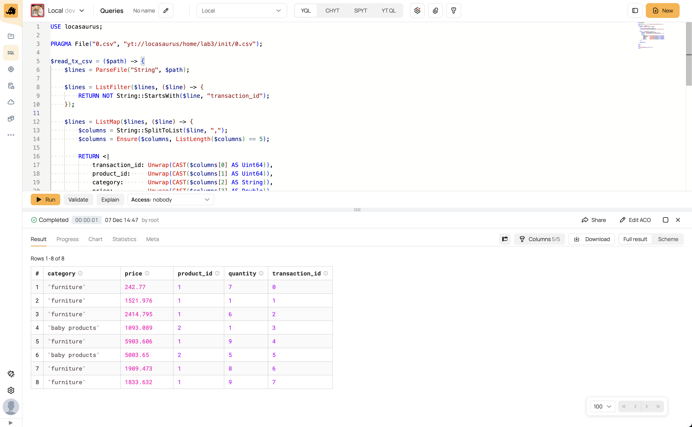

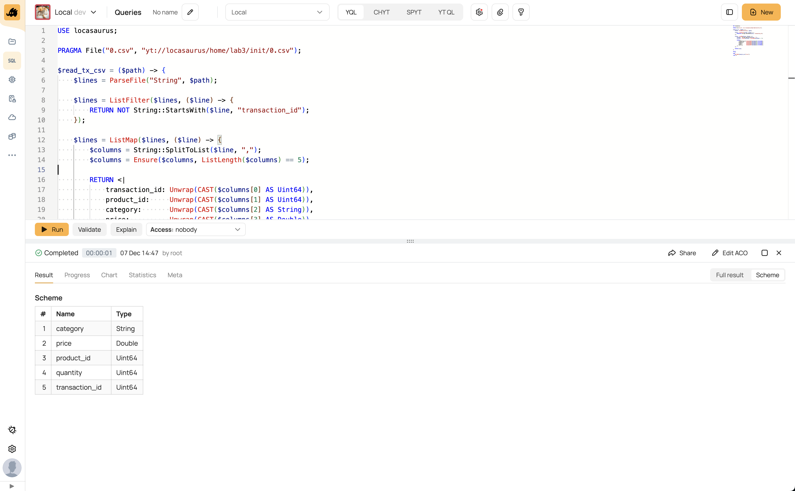

Объединим все данные в один поток и запишем в статическую таблицу.

```yql
USE locasaurus;

PRAGMA File("0.csv", "yt://locasaurus/home/lab3/init/0.csv");
PRAGMA File("1.csv", "yt://locasaurus/home/lab3/init/1.csv");
PRAGMA File("2.csv", "yt://locasaurus/home/lab3/init/2.csv");
PRAGMA File("3.csv", "yt://locasaurus/home/lab3/init/3.csv");
PRAGMA File("4.csv", "yt://locasaurus/home/lab3/init/4.csv");
PRAGMA File("5.csv", "yt://locasaurus/home/lab3/init/5.csv");
PRAGMA File("6.csv", "yt://locasaurus/home/lab3/init/6.csv");
PRAGMA File("7.csv", "yt://locasaurus/home/lab3/init/7.csv");

$read_tx_csv = ($path) -> { ... };

INSERT INTO `//home/lab3/tx/all` WITH TRUNCATE
SELECT
    *
FROM
    AS_TABLE(ListUnionAll(
        $read_tx_csv("0.csv"),
        $read_tx_csv("1.csv"),
        $read_tx_csv("2.csv"),
        $read_tx_csv("3.csv"),
        $read_tx_csv("4.csv"),
        $read_tx_csv("5.csv"),
        $read_tx_csv("6.csv"),
        $read_tx_csv("7.csv"),
    ))
;
```

Посмотрим на получившуюся таблицу.

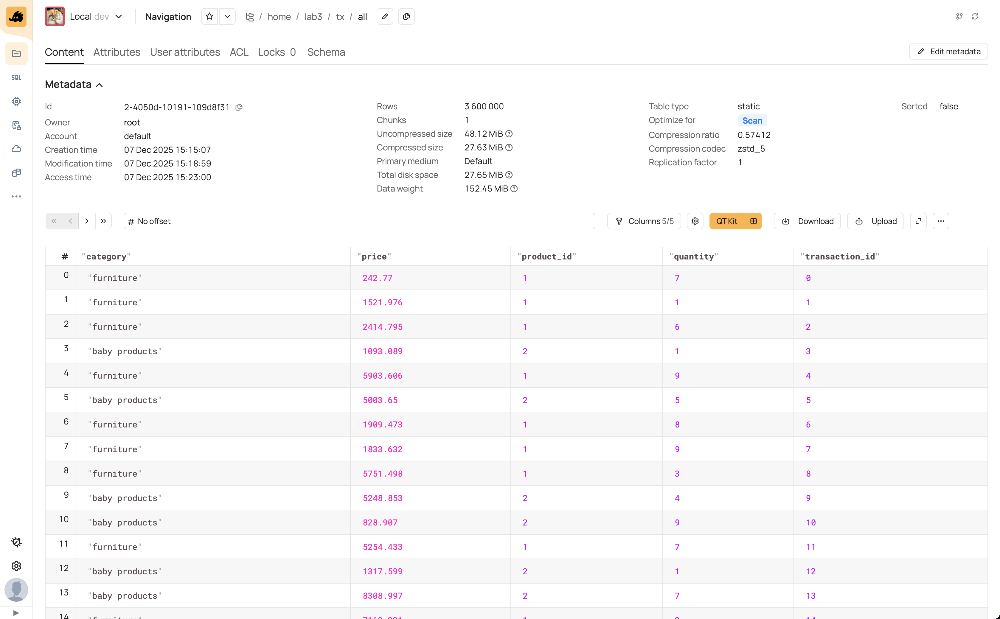

Видно, что она состоит лишь из одного Chunk, так как его размер ограничен 500MB.

Давайте попробуем сгенерировать много случайных данных.

```yql
USE locasaurus;

EVALUATE FOR $i IN ListFromRange(1, 100) DO BEGIN
    INSERT INTO `//home/lab3/tx/random`
    SELECT
        RandomNumber(transaction_id, $i) AS transaction_id,
        category AS category,
        RandomNumber(product_id, $i) AS product_id,
        Random(price, $i) AS price,
        RandomNumber(quantity, $i) AS quantity,
    FROM
        `//home/lab3/tx/all`
    ;
END DO;
```

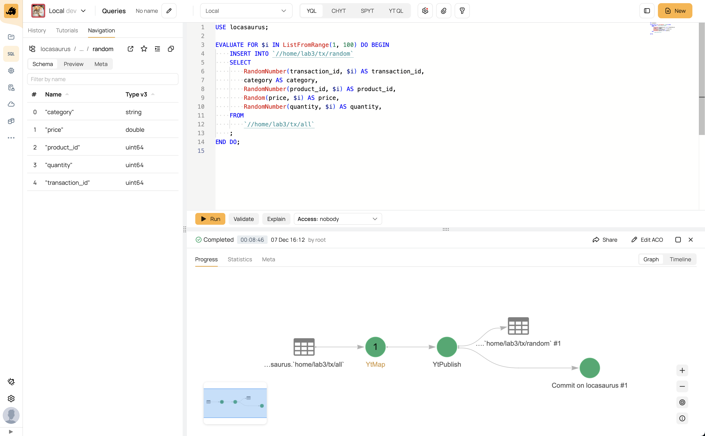

Теперь таблица занимает 3 chunks.

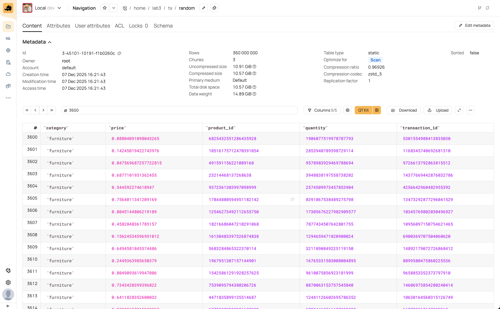

## Выполнение задания на YQL

### Вычислить общую выручку для каждой категории товаров

Составим запрос на YQL.

```yql
SELECT
    category,
    Sum(price * quantity) AS revenue
FROM
    locasaurus.`//home/lab3/tx/random`
GROUP BY
    category
;
```

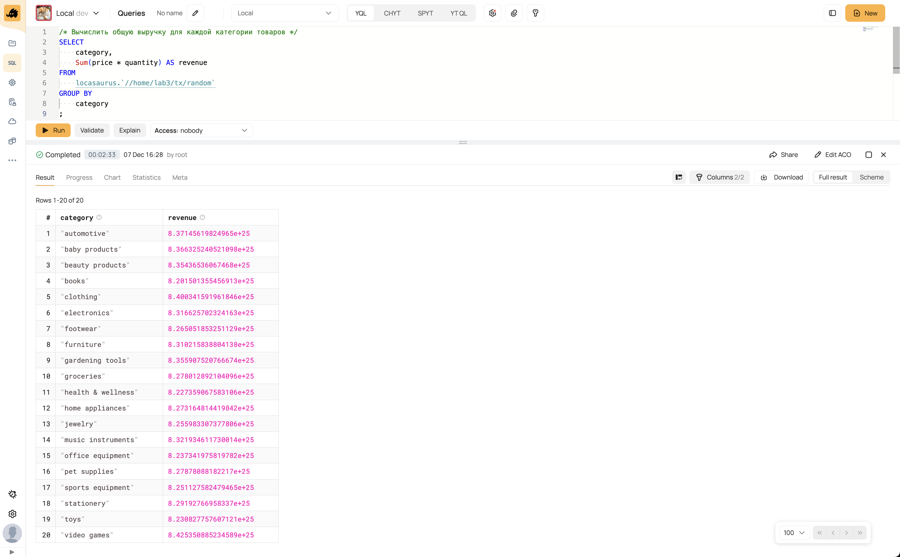

Заметим по графику, что данные генерировались из равномерного распределения.

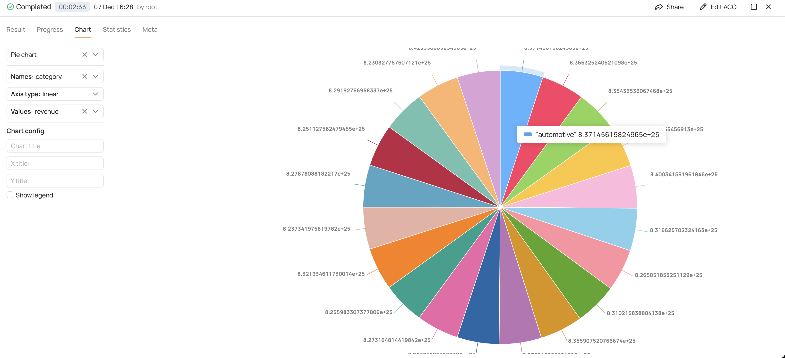

Рассмотрим подробно граф вычислений. Операция была выполнена в 2 стадии: `YtMap` и `YtMapReduce`. На первую стадию было выделено 11 Jobs, а на вторую -- 2 Jobs.

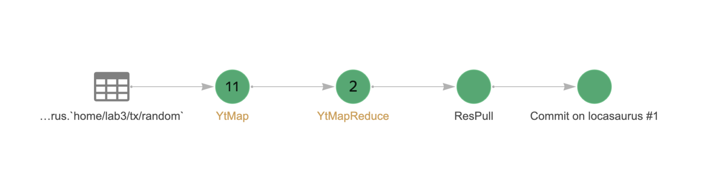

Рассмотрим порожденный для `YtMap` YQLs-mapper. Исходя из исходного кода YQL попробуем определить, что он делает. Ключевым является callable `WideCombiner`. Типизация данного узла происходит в процедуре [WideCombinerWrapper](https://github.com/ytsaurus/ytsaurus/blob/9a3195c49650430b6df6aa1ea199ce6388ed4b55/yql/essentials/core/type_ann/type_ann_wide.cpp#L324). Внимательно ознакомившись с отборным C++-кодом мы понимаем семантику аргументов и поясняем комментариями в сгенерированном YQLs.

```yqls
(
(return (lambda '($1) (block '(
  (return (WideCombiner
    $1                              # WideFlow
    '134217728                      # memLimit
    (lambda '($3 $4 $5)             # keyExtractor
      $3)
    (lambda '($6 $7 $8 $9)          # initHandler
      (* $8 $9)) #
    (lambda '($10 $11 $12 $13 $14)  # updateHandler
      (AggrAdd (* $12 $13) $14))
    (lambda '($15 $16) $16 $15)     # finishHandler
  )))))))
```

- `WideFlow` -- это поток строк на вход. Wide означает, что они представлены в колоночном виде.

- `memLimit` -- это ограничение по RAM или Disk, наверное.

- `keyExtractor` принимает на вход строку и возвращает ключ агрегации. Догадываемся, что `$3` тут -- `category`.

- `initHandler` инициализирует состояние агрегации по заданному ключу. Догодываемся, что `$8` тут -- `price`, а `$9` -- `quantity`.

- `updateHandler` обвновляет состояние агрегации. Предыдущий стейт лежит в `$14`.

- `finishHandler` получает из стейта финальный результат. Поскольку агрегация тут была проделана только для одного блока данных, это еще не финальный-финальный результат.

Судя по коду, `WideCombiner` возвращает поток кортежей с типами аргументов `updateHandler`. Не уверен, какой точно у него тип.

Посмотрим теперь на `YtMapReduce` YQLs-reducer (mapper равен identity). Тут упомянуты `WideMap` и `WideCondense1`.

```yqls
(
  (return (lambda '($1) (block '(
    (return (WideMap
      (WideCondense1
        $1                              # stream
        (lambda '($6 $7 $8)             # initLambda (item)
          $6 $8)
        (lambda '($9 $10 $11 $12 $13)   # switchLambda (item, state)
          $10)
        (lambda '($14 $15 $16 $17 $18)  # updateLambda (item, state)
          (AggrAdd $14 $17) $18)
      )
      (lambda '($19 $20) $20 $19)
    ))))))
)
```

- `WideMap` -- это, наверное, аналог `Map`, но для блочности. Просто `Map`.

- `WideCondense1` -- это, наверное, аналог `Condense1`, но для блочности. Получает первоначальный `state` из первого элемента потока. Если `switch` возвращает true, то выдает в поток накопленный `state`, иначе обновляет его при помощи `update`.

Есть ощущение, что это работает только с отсортированными данными. Обртимся к документации. На странице [MapReduce](https://ytsaurus.tech/docs/ru/user-guide/data-processing/operations/mapreduce) нас будет ждать ответ.

> Выходные данные map стадии делятся по хешу от ключа на партиции.
> ...
> Каждый пользовательский скрипт reduce стадии (reducer) обслуживает одну партицию: ... Каждая партиция сортируется в памяти по ключу ... Затем сортированные данные подаются на вход reduce джобу.

Еще есть какие-то settings:

```yqls
(
  (let $1 (StructType
    '('_yql_agg_0 (DataType 'Double))
    '('_yql_sys_tablekeyswitch (DataType 'Bool))
    '('category (DataType 'String))))
  (return '(
    '('reduceBy '('category))
    '('keySwitch)
    '('flow '101)
    '('reduceInputType $1))))
```

### Подсчитать общее количество проданных товаров по категориям

Аналогично предыдущему заданию. Даже ничего показывать не буду.

```yql
SELECT
    category,
    Sum(quantity) AS quantity
FROM
    locasaurus.`//home/lab3/tx/random`
GROUP BY
    category
;
```

### Отсортировать категории по общей выручке в порядке убывания

То же самое, что и задание 2, но добавляется сортировка в конце.

```yql
SELECT
    category,
    Sum(price * quantity) AS revenue
FROM
    locasaurus.`//home/lab3/tx/random`
GROUP BY
    category
ORDER BY
    revenue
;
```

Граф получается на одну вершину больше. Причем результаты берутся из кэша от предыдущего запуска.

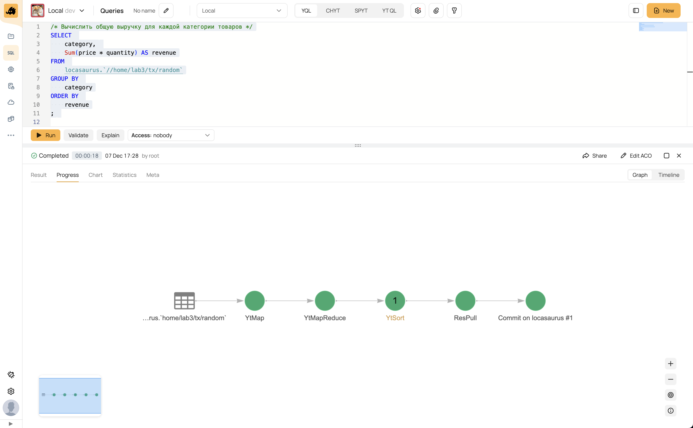

Так как данных на вход подается очень мало, то и отрабатывает эта сортировка очень быстро.

## Выполнение задание на C++

YQL -- это, конечно, круто, но давайте пострадаем. За основу возьмем пример проекта, описанный в [yt/cpp/mapreduce/examples/tutorial/simple_map_tnode](https://github.com/ytsaurus/ytsaurus/tree/main/yt/cpp/mapreduce/examples/tutorial/simple_map_tnode).

Настроим переменные окружения:

```bash
export YT_LOG_LEVEL=INFO
```

Запустим YT (важно запустить минимум 3 data-nodes):

```bash
./run_local_cluster.sh --node-count 3
```

Опишем схему таблиц.

```cpp
const struct {
  const TString TransactionId = "transaction_id";
  const TString Category = "category";
  const TString ProductId = "product_id";
  const TString Price = "price";
  const TString Quantity = "quantity";
  const TString Revenue = "revenue";
} Schema;
```

Реализуем `Mapper`.

```cpp
class TPredaggregationMapper final
    : public IMapper<TTableReader<TNode>, TTableWriter<TNode>> {
public:
  void Do(TReader *reader, TWriter *writer) override {
    THashMap<TString, double> revenueByCategory;

    for (auto &cursor : *reader) {
      const auto &row = cursor.GetRow();

      const TString &category = row[Schema.Category].AsString();
      const double price = row[Schema.Price].AsDouble();
      const ui64 quantity = row[Schema.Quantity].AsUint64();

      const double revenue = price * quantity;

      revenueByCategory[category] += revenue;
    }

    TVector<TNode> rows(Reserve(revenueByCategory.size()));
    for (const auto &[category, revenue] : revenueByCategory) {
      rows.emplace_back(TNode()                     //
                        (Schema.Category, category) //
                        (Schema.Revenue, revenue));
    }

    writer->AddRowBatch(rows);
  }
};
REGISTER_MAPPER(TPredaggregationMapper);
```

Теперь нужно написать reducer. Посмотрим в [yt/cpp/mapreduce/examples/tutorial/simple_reduce_tnode](https://github.com/ytsaurus/ytsaurus/blob/main/yt/cpp/mapreduce/examples/tutorial/simple_reduce_tnode).

```cpp
class TAggregationReducer final
    : public IReducer<TTableReader<TNode>, TTableWriter<TNode>> {
public:
  void Do(TReader *reader, TWriter *writer) override {
    const auto &row = reader->GetRow();
    const TString category = row[Schema.Category].AsString();

    double revenue = 0;
    for (auto &cursor : *reader) {
      const auto &row = cursor.GetRow();
      revenue += row[Schema.Revenue].AsDouble();
    }

    writer->AddRow(TNode()                     //
                   (Schema.Category, category) //
                   (Schema.Revenue, revenue));
  }
};
REGISTER_REDUCER(TAggregationReducer);
```

Опишем конфигурацию графа вычислений.

```cpp
const struct {
  const TCreateClientOptions Client =
      TCreateClientOptions().ProxyAddress("localhost:8000");

  const struct {
    const struct {
      const TString Input = "//home/lab3/tx/all";
      const TString Predaggregation = "//tmp/tx-all-predaggregation";
      const TString SortedPredaggregation =
          "//tmp/tx-all-sorted-predaggregation";
      const TString Aggregation = "//tmp/tx-all-aggregation";
      const TString SortedAggregation = "//tmp/tx-all-sorted-aggregation";
    } Table;

    const TMapOperationSpec Predaggregation =
        TMapOperationSpec()
            .AddInput<TNode>(Table.Input)
            .AddOutput<TNode>(Table.Predaggregation);

    const TSortOperationSpec SortedPredaggregation =
        TSortOperationSpec()
            .AddInput(Table.Predaggregation)
            .Output(Table.SortedPredaggregation)
            .SortBy({Schema.Category});

    const TReduceOperationSpec Aggregation =
        TReduceOperationSpec()
            .AddInput<TNode>(Table.SortedPredaggregation)
            .AddOutput<TNode>(Table.Aggregation)
            .ReduceBy({Schema.Category});

    const TSortOperationSpec SortedAggregation =
        TSortOperationSpec()
            .AddInput(Table.Aggregation)
            .Output(Table.SortedAggregation)
            .SortBy({Schema.Category});

  } Stage;
} PipelineOptions;
```

Запустим все вместе.

```cpp
int main() {
  Initialize();

  const IClientPtr client = CreateClient("locasaurus", PipelineOptions.Client);
  client->Remove(PipelineOptions.Stage.Table.Predaggregation,
                 TRemoveOptions().Force(true));
  client->Remove(PipelineOptions.Stage.Table.SortedPredaggregation,
                 TRemoveOptions().Force(true));
  client->Remove(PipelineOptions.Stage.Table.Aggregation,
                 TRemoveOptions().Force(true));
  client->Remove(PipelineOptions.Stage.Table.SortedAggregation,
                 TRemoveOptions().Force(true));

  client->Map(PipelineOptions.Stage.Predaggregation, new TPredaggregationMapper)
      ->Watch()
      .Wait();
  client->Sort(PipelineOptions.Stage.SortedPredaggregation)->Watch().Wait();
  client->Reduce(PipelineOptions.Stage.Aggregation, new TAggregationReducer)
      ->Watch()
      .Wait();
  client->Sort(PipelineOptions.Stage.SortedAggregation)->Watch().Wait();

  return 0;
}
```

Наблюдаем операции в YT Web UI.

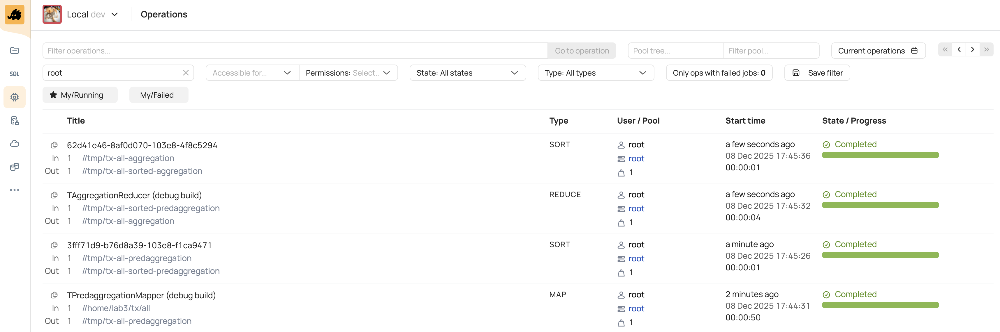

Времена работы логичны. У нас достаточно мало категорий -- около 20 штук. После первого `Map` данные значительно сокращаются.

Давайте попробуем сравнить время работы с запросом на YQL.

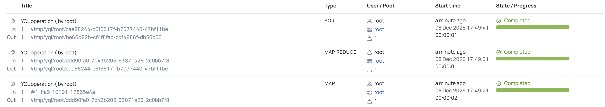

Не удивительно, ведь запрос на YQL есть компилируется с включенными оптимизациями. Давайте попробуем собрать наш граф в Release и запустить.

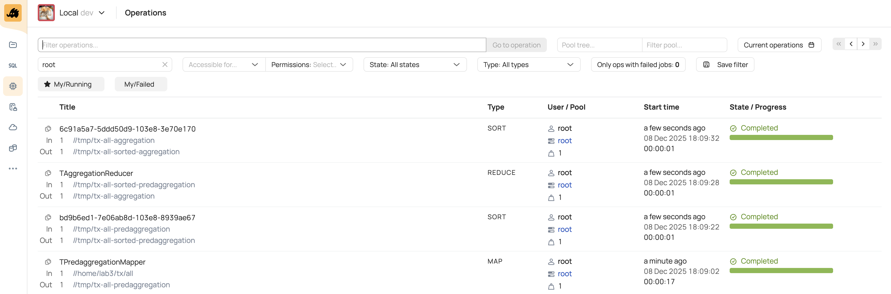

Уже лучше раза в 2.5, но все равно до YQL далеко... В чем же дело?

Обратимся к статистике операции. Рассмотрим статистику для C++.

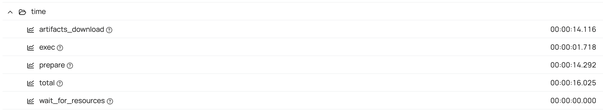

А теперь для YQL.

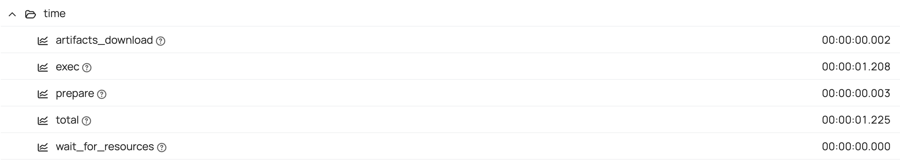

Теперь понятно, что нам в MR Job, видимо, скачивается таблица?.. Как бы запустить вычисления рядом с данными?

Заметим, стататистику что YQL операция читает строки более чем в 10 раз быстрее, чем наша бедная джоба на C++...

YQL:

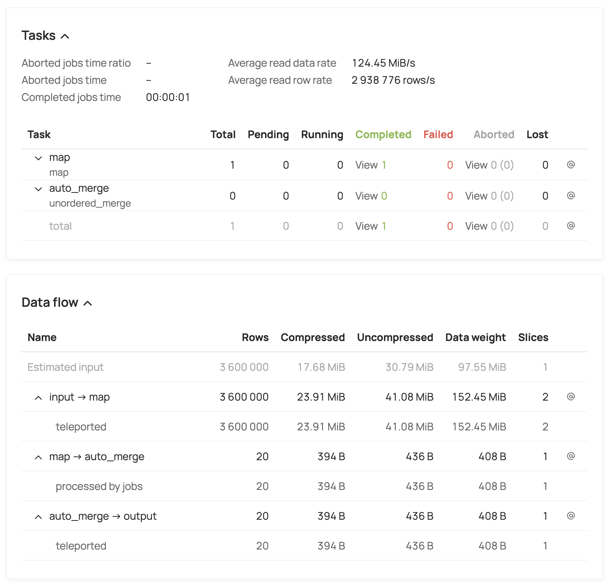

C++:

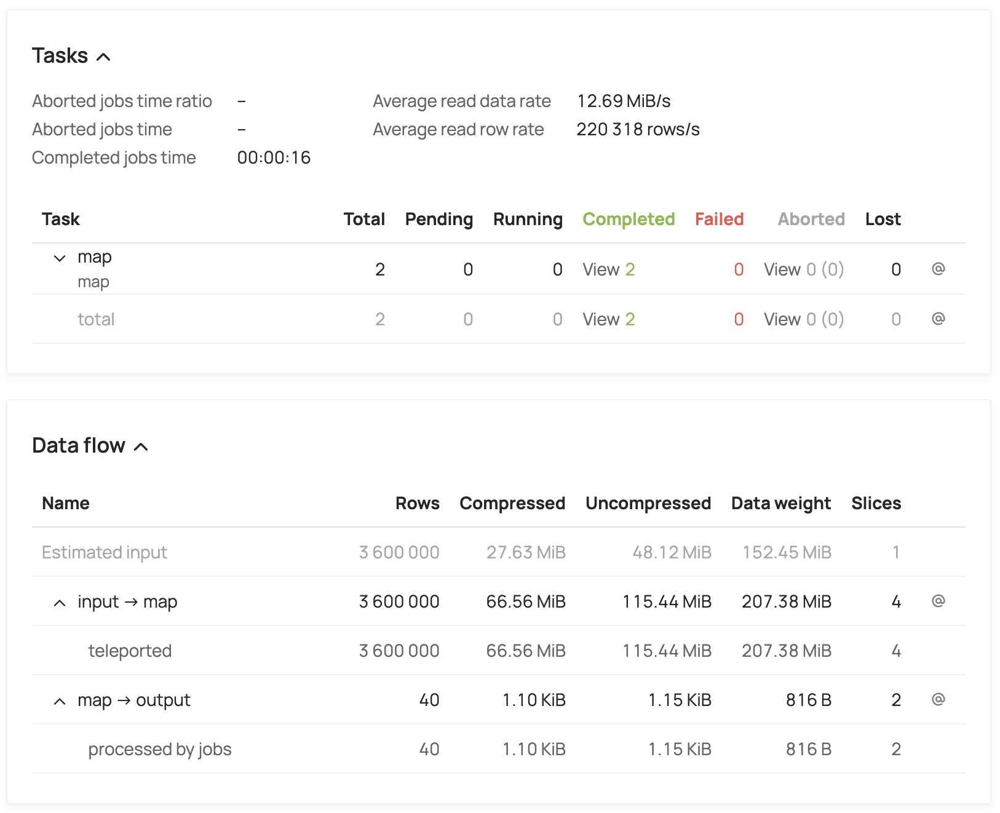

А вдруг проблема в перекладывании YSONов??? Давайте попробуем [Skiff](https://ytsaurus.tech/docs/ru/user-guide/storage/skiff)!

UPD: чето Skiff не полетел. Давайте попробуем [Protobuf по гайду](https://github.com/ytsaurus/ytsaurus/blob/main/yt/cpp/mapreduce/examples/tutorial/protobuf_complex_types)!

```proto
import "yt/yt_proto/yt/formats/extension.proto";

message TTxRow {
    optional uint64 transaction_id = 1  [(NYT.column_name) = "transaction_id"];
    optional string category = 2        [(NYT.column_name) = "category"];
    optional uint64 product_id = 3      [(NYT.column_name) = "product_id"];
    optional double price = 4           [(NYT.column_name) = "price"];
    optional uint64 quantity = 5        [(NYT.column_name) = "quantity"];
}
```

Другое дело!

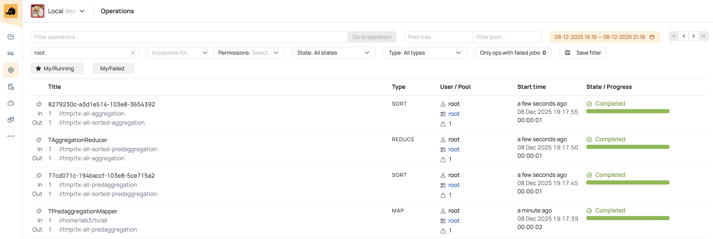

Проверяем пропускную способность.


Хватит на сегодня.
